## 攻击全景

### 方法论卡片

| 属性     | 值                                                |
| -------- | ------------------------------------------------- |
| 方法名称 | CE 辅助内存漏洞挖掘                               |
| 核心技术 | Cheat Engine 内存扫描与修改                       |
| 漏洞类型 | 逻辑漏洞、整数溢出、签名绕过、XSS                 |
| 目标类型 | 桌面应用、Web 应用、手游（模拟器）、C/S 架构      |
| 所需工具 | Cheat Engine 7.5+、Burp Suite、可选 IDA Pro/Frida |
| 难度等级 | 入门到进阶                                        |
| 检测难度 | 低（内存修改）到高（汇编注入）                    |
| 适用范围 | 服务端信任客户端参数的场景                        |

### 核心发现

CE 修改器在安全测试中的价值远超游戏修改。其核心洞察在于：**大量应用存在"前端信任"陷阱**——服务端依赖前端传递的参数（价格、数量、权限标志），而这些参数在前端内存中是可篡改的。CE 通过直接操作进程内存空间，能够发现数据包层不可见、前端不可控的深层次逻辑漏洞。

### 适用场景

- 服务端对客户端提交的参数缺乏二次校验
- 关键计算逻辑在客户端完成（如前端计算总价）
- 权限/状态标志位仅在前端维护
- 签名算法在客户端实现且密钥可定位
- 隐藏参数存在于内存但未在前端/数据包中暴露

### 方法演进时间线

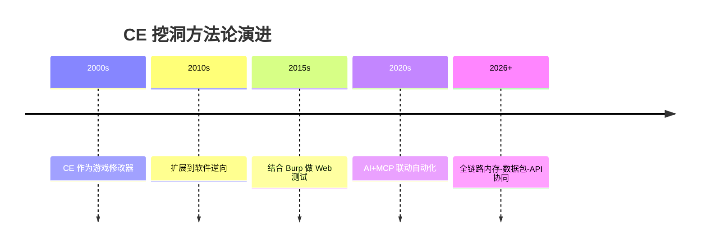
---

> **全景架构图**：下文是对 CE 辅助漏洞挖掘方法的文字化拆解。建议先打开全景架构图获得全局认知，再逐章深入阅读。
>

---

## 第一章：方法论总览

> 本章从核心思想、扫描方法、参数发现三个维度搭建完整的方法论框架。CE 将传统 Web 测试的视角从数据包层下沉至内存层，能够发现那些从未出现在前端代码或网络请求中的隐藏参数与信任边界。

### 1.1 CE 挖洞核心思想

Cheat Engine 辅助漏洞挖掘的核心流程是一个闭环：**附加进程 → 扫描值 → 过滤定位 → 修改观察 → 验证利用**。这个循环与传统动态测试的不同之处在于：CE 操作的是应用的**内存空间**，而非仅数据包层面的参数。

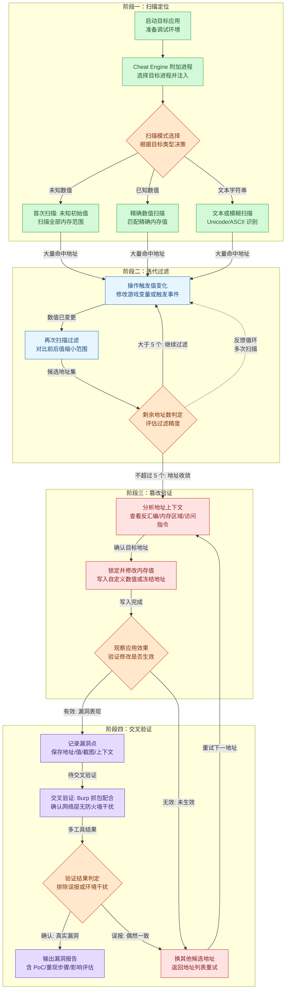
### 1.2 扫描方法论

CE 提供多种扫描策略以适应不同的测试场景：

| 场景                     | 扫描类型                   | 操作方式                     |
| ------------------------ | -------------------------- | ---------------------------- |
| 知道具体数值（金币 100） | 精确扫描                   | 直接输入数值，类型选 4 Bytes |
| 数值持续变化             | 未知初始值 → 增加/减少扫描 | 反复过滤缩小范围             |
| 布尔标志位（0 或 1）     | 精确扫描 Byte              | 搜索 0 或 1                  |
| 百分比或比率             | Float/Double 扫描          | 浮点数匹配                   |
| 隐藏参数名               | String 扫描                | 搜 isAdmin、vipLevel 等      |
| 特征码定位               | Array of Bytes             | 十六进制通配符匹配           |

#### 扫描策略选择决策

实际测试中，第一次扫描和后继扫描的策略往往不同，需要动态切换：

| 阶段       | 推荐策略   | 操作                               | 预期结果                         |
| ---------- | ---------- | ---------------------------------- | -------------------------------- |
| 第一次扫描 | 未知初始值 | 不输入任何值，直接扫描整个地址空间 | 获得全部有效内存地址（数百万个） |
| 第二次扫描 | 增加的数值 | 触发值增加操作后，筛选增加的地址   | 排除不变地址，保留增加的地址     |
| 第三次扫描 | 减少的数值 | 触发值减少操作后，筛选减少的地址   | 进一步缩小至数百或数十个         |
| 后续扫描   | 不变的数值 | 不操作目标，筛选未变化的地址       | 精确定位至 1~5 个候选地址        |

**工程经验**：实际挖洞中，不要追求一次扫描就定位。通常需要 4~6 轮操作-过滤循环。每轮操作要确保目标值确实发生了变化——如果过滤后地址数为 0，说明操作未改变目标值，需要回退到上一轮。


#### 类型选择原理

CE 的扫描类型选择直接影响结果精度。选错类型会导致漏报（实际存在的值搜不到）或大量误报（无关地址混入）：

- **4 Bytes** 是最通用的选择，覆盖大多数 int32 和 uint32 类型的变量
- 若已知目标为小数（如生命值 100.0），必须选 Float 或 Double 才能匹配
- 布尔标志位（0/1）用 Byte 扫描效率最高，因为 Byte 类型的地址空间最小
- 字符串扫描（String）不区分大小写，搜 `"admin"` 可匹配 `Admin`、`ADMIN` 等变体

### 1.3 参数发现策略

不是所有参数都在前端或数据包中可见。有些参数仅在内存中存在，前端根本不发送，但修改后会影响后端逻辑。这种"隐藏参数"是 CE 挖洞最大的价值所在。

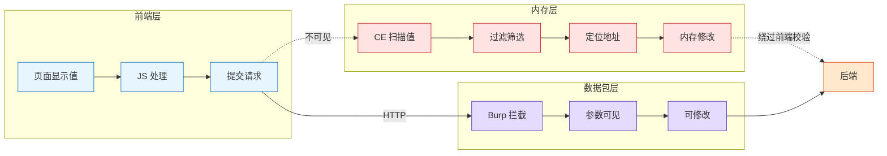
**三类参数的可控性对比**：

| 参数层级           | 可见范围                 | 修改方式             | CE 价值 |
| ------------------ | ------------------------ | -------------------- | ------- |
| 前端可见参数       | JS 变量、页面显示值      | 浏览器 DevTools 可改 | 低      |
| 数据包可见参数     | HTTP 请求参数            | Burp 可改            | 中      |
| **仅内存可见参数** | 内部标志位、缓存计算结果 | **仅 CE 可改**       | **高**  |

---

## 第二章：内存修改与数值篡改

### 2.1 整数溢出原理

整数溢出是 CE 挖洞中最基础也最高产的漏洞类型。其核心在于利用整数类型的边界特性，构造溢出使业务逻辑产生意料之外的跳转。

```
int32 最大值:  2,147,483,647  (0x7FFFFFFF)
int32 最小值: -2,147,483,648  (0x80000000)

溢出示例:
  2,147,483,647 + 1 = -2,147,483,648  (正→负 溢出)
  -2,147,483,648 - 1 = 2,147,483,647  (负→正 溢出)
```

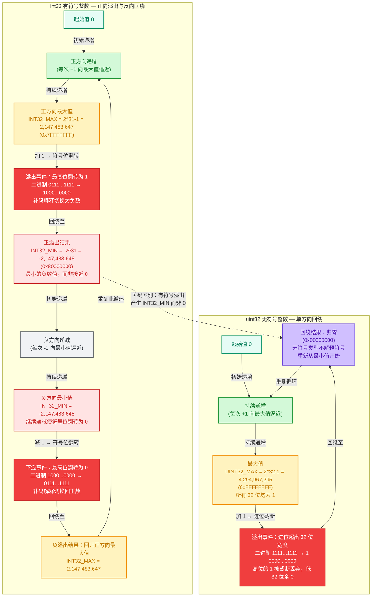
下面这段 C 代码演示了整数溢出的具体行为：

```c
#include <stdio.h>
#include <stdint.h>

int main() {
    int32_t balance = 2147483647;  // int32 最大值
    printf("余额: %d\n", balance);

    // 攻击者通过 CE 将余额 +1
    balance += 1;
    printf("余额 +1 后: %d\n", balance);
    // 输出: -2147483648 — 正数变负数！

    // 若业务逻辑允许负数扣款
    int32_t purchase = 100;
    int32_t new_balance = balance - purchase;
    printf("扣款 %d 后余额: %d\n", purchase, new_balance);
    // 输出: 2147483548 — 从负数扣款反而变正

    return 0;
}
```

### 2.2 溢出测试方法论

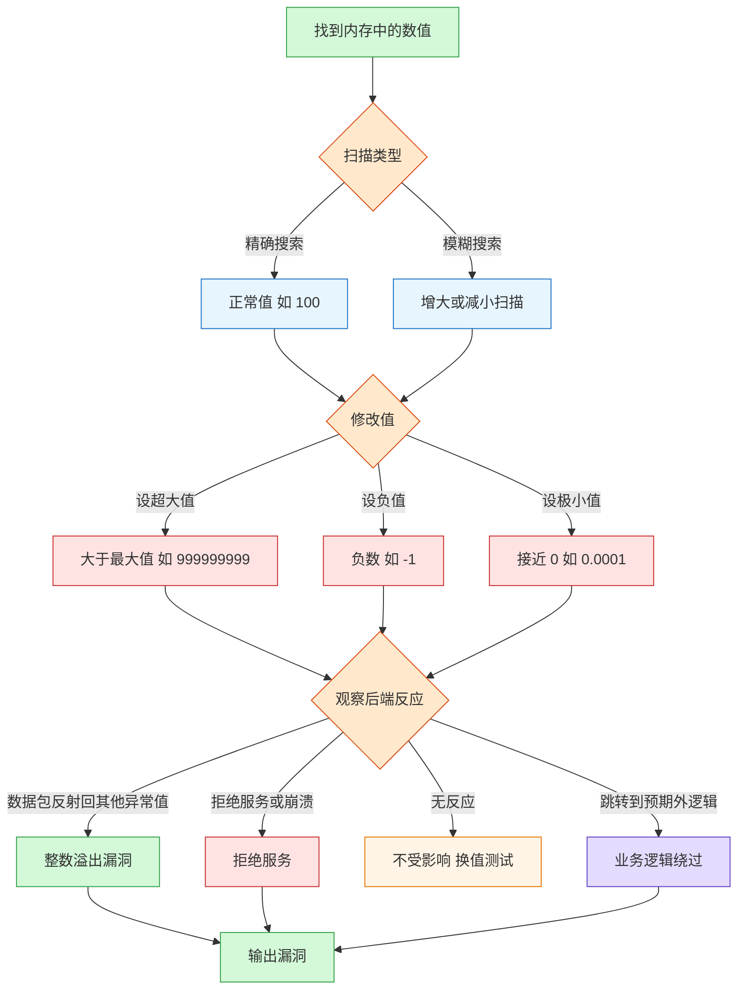
### 2.3 数据类型边界测试表

| 数据类型        | 最小值         | 最大值        | CE 扫描类型 | 测试 Payload          |
| --------------- | -------------- | ------------- | ----------- | --------------------- |
| int32 (signed)  | -2,147,483,648 | 2,147,483,647 | 4 Bytes     | 9999999999            |
| uint32          | 0              | 4,294,967,295 | 4 Bytes     | -1, 0xFFFFFFFF        |
| int64           | -9.22e18       | 9.22e18       | 8 Bytes     | 9223372036854775807+1 |
| float (单精度)  | -3.4e38        | 3.4e38        | Float       | 3.5e38                |
| double (双精度) | -1.7e308       | 1.7e308       | Double      | 1.8e308               |
| short (2 字节)  | -32,768        | 32,767        | 2 Bytes     | 65535                 |
| byte (1 字节)   | -128           | 127           | Byte        | 255                   |

### 2.4 浮点精度绕过

某些校验仅做整数范围检查，浮点数可以绕过这些限制：

- CE 中切换扫描类型为 `Float` 或 `Double`
- 测试极小值（接近 0 的正浮点数）
- 测试极大值（远超业务范围的上限）
- 利用 IEEE 754 浮点表示的特殊值（NaN、Infinity、-0）

### 2.5 实战场景

```
金额溢出:  单价 x 数量 = 总价
  设数量为 999999999 → 总价 int32 溢出 → 变成负数或极小值 → 支付负数金额

经验值溢出:  当前经验 + 获得经验 = 总经验
  固定经验值后修改 → 溢出 → 等级归零或变成超高级别

倒计时绕过:  倒计时从 60 秒开始递减
  搜索 60 → 值变化后过滤 → 锁定为 0 → 跳过等待期
```

### 2.6 溢出模式分类与检测策略

不同整数类型和运算方式产生的溢出形态各不相同，检测和利用策略也有所差异：

| 溢出模式     | 触发条件               | 典型效果            | CE 检测方式            |
| ------------ | ---------------------- | ------------------- | ---------------------- |
| **加法上溢** | 正数 + 正数 > 最大值   | 结果变为负数        | 设超大值观察数据包     |
| **加法下溢** | 负数 + 负数 < 最小值   | 结果变为正数        | 设极负值观察           |
| **乘法溢出** | 两数相乘 > 最大值      | 结果远小于预期      | 设大数量配合单价       |
| **减法下溢** | 0 - 正数（unsigned）   | unsigned 变成极大值 | 设 0 后触发减法        |
| **循环溢出** | 计数器不断 +1 直到溢出 | 绕过计数限制        | 锁定计数器为最大值附近 |

#### unsigned 减法下溢的特殊性

无符号整数的减法下溢在实战中比 signed 溢出更隐蔽，影响也更大：

```c
#include <stdio.h>
#include <stdint.h>

int main() {
    uint32_t balance = 100;  // 无符号余额
    uint32_t deduction = 200; // 扣减金额大于余额

    // 正常逻辑应检查 balance >= deduction
    // 但若程序员遗漏此检查：
    uint32_t result = balance - deduction;
    printf("余额 %u - 扣减 %u = %u\n", balance, deduction, result);
    // 输出: 100 - 200 = 4294967196  （变成一个巨大的正数！）

    // 若后续有充值逻辑：new_balance = result + deposit
    uint32_t deposit = 50;
    uint32_t new_balance = result + deposit;
    printf("充值 %u 后: %u\n", deposit, new_balance);
    // 输出: 4294967246  — 永久性的巨大余额

    return 0;
}
```

**检测技巧**：在 CE 中搜索到 uint32 类型的值时，将其设为 0 然后触发减法操作。观察结果是否变成接近 0xFFFFFFFF 的值。如果是，说明存在 unsigned 减法下溢漏洞。

#### 乘法的溢出链放大效应

乘法溢出的特殊之处在于其放大效应：参与计算的两个值均由攻击者控制时（如单价和数量），溢出效果会被指数级放大。

```
典型乘法溢出攻击链：

  商品单价: 1,000,000     ← CE 修改
  购买数量: 9,999,999     ← CE 修改
  期望总价: 10^13  (超出 int32 范围)
  实际总价: 1,410,065,408 (溢出截断后的值)
  
  服务端校验: 总价 1,410,065,408 > 余额 10,000 → 拒绝？还是截断后比较？
  漏洞发现: 若服务端用 int32 接收 → 可进一步溢出为负数！
  
  int32 总价: 1,410,065,408 > int32 最大值 2,147,483,647?
  否 → 未溢出到负数。继续增加数量:
  数量 14,999,999 → 总价 ~1.5e13 → int32 截断 → 约 -1.7e9 → 负数！
```

---

## 第三章：签名绕过技术

### 3.1 核心思路

传统签名验证流程中，客户端计算签名后提交给服务端验证。CE 的介入点在于：**签名计算过程中的参数值、签名结果值均在内存中，可以被锁定或篡改。**

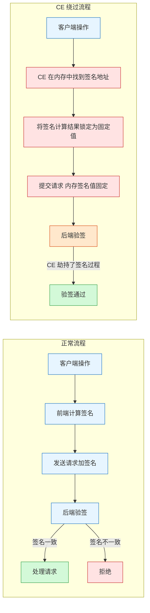
### 3.2 三种绕过手法

| 手法           | 描述                                                         | 适用场景                             | 难度 |
| -------------- | ------------------------------------------------------------ | ------------------------------------ | ---- |
| **值锁定**     | CE 锁定签名关键参数（timestamp、nonce 等），反复提交通用签名 | 签名中使用了可预测的时间或随机值     | 低   |
| **返回包篡改** | 修改后端返回的确认值，再提交给后端，形成确认套娃             | 后端对返回包中的数据缺乏完整性校验   | 中   |
| **本地固化**   | 将某参数固定在内存中，重启模块后参数仍然不变                 | 参数只在启动时加载一次，后续不再校验 | 中   |

### 3.3 详细绕过流程

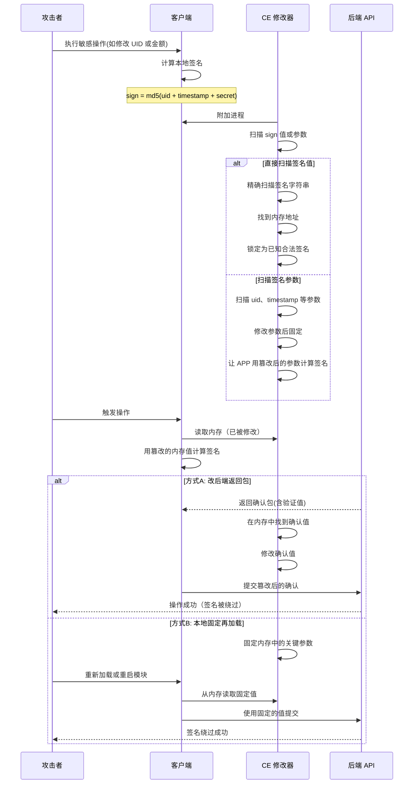
### 3.4 签名算法逆向与 HMAC 绕过

当签名使用 HMAC（基于哈希的消息认证码）时，客户端保存的密钥本身就在内存中：

```python
## 常见的客户端签名算法示例（如 Unity 游戏或 Web 应用）
import hashlib, hmac, json

def client_sign_request(params, secret):
    """
    params: 请求参数的 JSON 字符串
    secret: 客户端硬编码的密钥（在内存中可被 CE 定位）
    """
    message = json.dumps(params, separators=(',', ':'))
    # HMAC-SHA256 签名
    signature = hmac.new(
        secret.encode('utf-8'),
        message.encode('utf-8'),
        hashlib.sha256
    ).hexdigest()
    return signature

## CE 介入点分析：
## 1. secret 字符串：在内存中以明文存在 → CE String 扫描可定位
## 2. signature 结果：每次调用后存储在栈或堆上 → CE 可冻结
## 3. message 参数：拼接过程中在临时缓冲区 → CE 可篡改

## 绕过策略 A：直接替换 secret
##   在内存中找到 secret → 替换为已知密钥 → 前端用已知密钥签名
##   → 服务端收到后用已知密钥验签 → 通过（若服务端信任客户端密钥）

## 绕过策略 B：锁定 signature 结果
##   首次获取合法签名 → CE 冻结 signature 内存地址 → 反复提交
##   → 即使参数变更，signature 值不变 → 绕过完整性校验
```

**HMAC 绕过的关键难点**：如果服务端为每个请求生成不同的随机 nonce，且 nonce 在客户端不可控的前端逻辑中参与签名，则直接值锁定无效。此时需要结合 CE + Frida 联动（见第九章）Hook 随机数生成函数。

### 3.5 签名绕过成功率的决定因素

| 因素           | 高成功率                 | 低成功率                        |
| -------------- | ------------------------ | ------------------------------- |
| 密钥存储位置   | 客户端内存明文           | 安全芯片或远程 attestation      |
| 签名参数随机性 | nonce 可控或可预测       | nonce 由服务端下发的 token 决定 |
| 签名算法复杂度 | 简单拼接 + MD5           | HMAC-SHA256 + 时间戳 + nonce    |
| 服务端校验     | 仅验签，不检查参数完整性 | 验签 + 参数范围检查 + 频率限制  |

---

## 第四章：浏览器进程精准定位

### 4.1 多进程架构概览

现代浏览器（Chrome、Edge、360 等）采用**多进程架构**，一个标签页对应一个独立渲染进程。CE 如果附加错了进程，就搜不到目标值。掌握进程定位技巧是浏览器端内存修改的第一步。

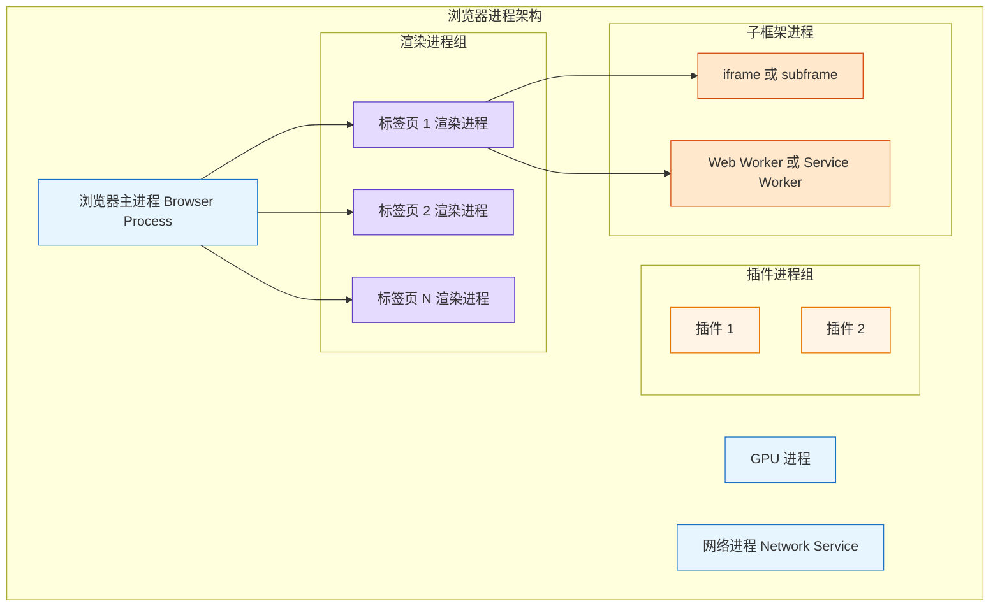
**关键认知**：

- 每个标签页是**独立进程**（PWA、普通页面、隐身模式各不同）
- 目标应用在**渲染进程**中，不是主进程
- WASM、JS 堆、DOM 数据都在渲染进程的私有内存空间
- 附加错了进程 → 搜不到任何值

### 4.2 PID 进制转换

Chrome 任务管理器显示十进制 PID，Windows 任务管理器可能显示十六进制 PID。进制不匹配时需要通过转换来交叉定位。

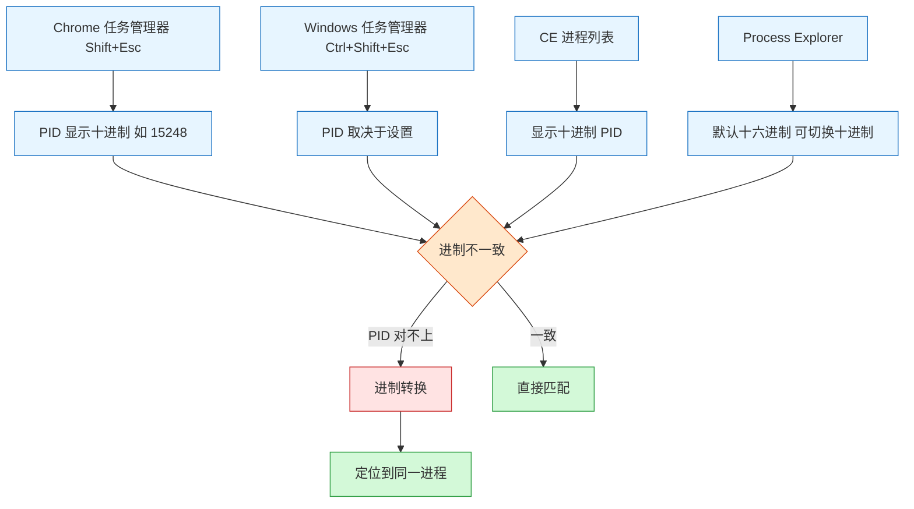
**进制转换速查**：

| Chrome PID (十进制) |   十六进制    | 说明                     |
| :-----------------: | :-----------: | ------------------------ |
|     10000~12000     | 0x2710~0x2EE0 | 常见渲染进程区间         |
|     13000~16000     | 0x32C8~0x3E80 | 密集标签页区间           |
|     20000~30000     | 0x4E20~0x7530 | 高负载浏览器区间         |
|       40000+        |    0x9C40+    | 长期不关浏览器的累积 PID |

**快速转换方法**：

```cmd
:: PowerShell 转换
[Convert]::ToString(15248, 16)    :: 十进制→十六进制 → "3b90"
0x3B90                             :: 十六进制→十进制 → 15248

:: Windows 计算器
Win+R → calc → Ctrl+3 (程序员模式)  → HEX/DEC 自动互转

:: Python 一行转换
python -c "print(hex(15248))"       :: → 0x3b90
python -c "print(int('0x3b90',16))" :: → 15248
```

### 4.3 四大定位方法

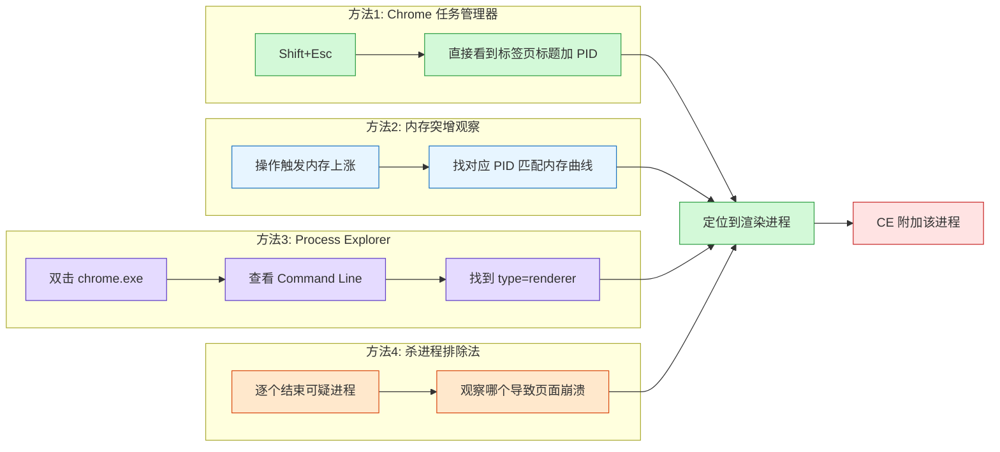
**Process Explorer 命令行分析**（最可靠）：

```
chrome.exe --type=renderer --pid=15248 --app-id=xxxxxxxx
           ↑ 这就是目标标签页的渲染进程
```

### 4.4 CE 快速定位浏览器的 7 个技巧

|  #   | 技巧                        | 说明                                             | 推荐度 |
| :--: | --------------------------- | ------------------------------------------------ | :----: |
|  1   | **Shift+Esc 直查**          | Chrome 内建任务管理器，直接看到标签页标题加 PID  |  ⭐⭐⭐   |
|  2   | **内存突增定位**            | 触发操作 → 观察哪个进程内存上涨 → 锁定目标       |  ⭐⭐⭐   |
|  3   | **Process Explorer 命令行** | 查看 `--type=renderer` 参数，确认渲染进程        |  ⭐⭐⭐   |
|  4   | **管理员提权**              | CE 以管理员运行 → 勾选 All Memory Types → 重新扫 |   ⭐⭐   |
|  5   | **进制转换核对**            | Chrome 十进制 vs Windows 十六进制 → 计算器验证   |   ⭐⭐   |
|  6   | **杀进程排除法**            | 结束可疑进程，看哪个导致页面崩溃                 |   ⭐    |
|  7   | **单进程模式**              | `chrome.exe --single-process`，简化定位          |   ⭐⭐   |

### 4.5 快速定位检查清单

```
□ 确认目标应用运行在浏览器中
□ 打开 Chrome 任务管理器 (Shift+Esc)
□ 找到标签页对应的 PID（十进制）
□ CE 以管理员身份运行
□ 在 CE 进程列表中找到该 PID 的 chrome.exe
□ 勾选 All Memory Types
□ 开始扫描目标值
□ 如果搜不到：
   □ 确认附加的是渲染进程不是主进程
   □ 用 Process Explorer 查看命令行是否 --type=renderer
   □ 用单进程模式重试
   □ 检查值是否被加密（用模糊扫描）
```

### 4.6 浏览器安全架构对 CE 挖洞的影响

理解浏览器安全架构对 CE 挖洞效率有直接影响。现代浏览器的三层安全模型决定了哪些内存区域可被 CE 访问：

| 安全层                         | 机制                     | 对 CE 的影响                                            |
| ------------------------------ | ------------------------ | ------------------------------------------------------- |
| **站点隔离**（Site Isolation） | 每个源分配到独立渲染进程 | 不同站点的数据不在同一进程，CE 只能看到当前标签页的数据 |
| **沙箱**（Sandbox）            | 渲染进程运行在受限沙箱中 | CE 可读取内存，但沙箱限制了对系统 API 的调用            |
| **地址空间布局随机化**（ASLR） | 每次启动内存基址随机化   | CE 指针扫描需要每次重新解析地址链                       |
| **分区堆**（PartitionAlloc）   | 不同类型数据分区域存储   | 数值和字符串可能不在同一内存区域，需要分区扫描          |

**对挖洞的实战启示**：

- 如果需要同时修改两个标签页的数据，需要开两个 CE 实例分别附加
- 隐身模式下打开的页面使用独立进程，容易被误认为是同一个进程
- WebAssembly 的内存区域在 PartitionAlloc 中被标识为 WASM 专用区域，CE 中显示为一整块连续的 MEM_PRIVATE 空间
- 浏览器沙箱不影响 CE 的 ReadProcessMemory，但影响内联汇编注入的稳定性

#### 跨进程数据追踪

当目标应用使用 iframe 或 Worker 线程处理数据时，数据可能分布在多个进程中：

```cmd
:: Chrome 中查看所有关联进程
chrome://process-internals    :: 显示所有进程树关系

:: 找到特定 iframe 的进程 ID
:: 打开目标页面 → 开发者工具 → Console
console.log(window.frames[0].location);  :: 查看 iframe 的源
:: 用 Shift+Esc 打开任务管理器 → 按内存排序 → 找到对应标签页
```

CE 挖洞时的应对策略：

- 主页面数据搜索不到时，检查是否在 Worker 线程进程中
- 优先使用 Chrome 任务管理器（Shift+Esc）而非 Windows 任务管理器定位
- 对多进程目标，可用杀进程排除法逐一确认数据归属

---

## 第五章：CE 内部原理深度解析

### 5.1 CE 内存访问架构

理解 CE 的底层架构，是精通挖洞的前提。CE 通过三层的访问路径操作目标进程内存：

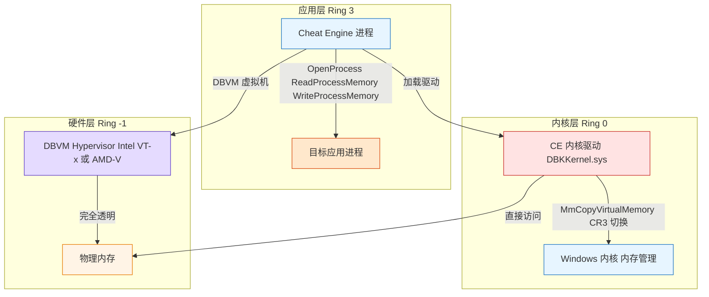
### 5.2 扫描引擎工作原理

CE 扫描引擎通过 Windows API 与目标进程交互，逐层缩小候选地址范围：

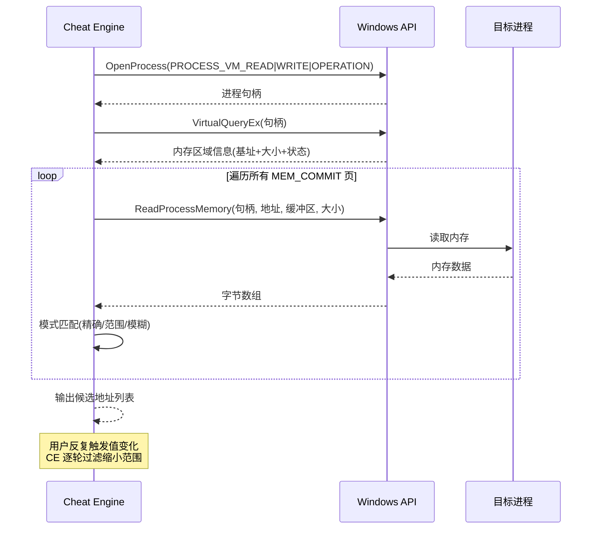
| 步骤        | Windows API 调用                                 | 说明                             |
| ----------- | ------------------------------------------------ | -------------------------------- |
| 1. 打开进程 | `OpenProcess(PROCESS_VM_READ\|WRITE\|OPERATION)` | 获取目标进程句柄                 |
| 2. 内存枚举 | `VirtualQueryEx()`                               | 遍历进程地址空间，过滤有效页     |
| 3. 值读取   | `ReadProcessMemory()`                            | 从每个地址读取目标类型的值       |
| 4. 模式匹配 | 用户态比较引擎                                   | 精确/范围/模糊匹配（增/减/不变） |
| 5. 排除过滤 | 反复扫描缩小候选集                               | 每次变更后重新扫描，排除不变地址 |
| 6. 结果返回 | 展示剩余地址列表                                 | 用户选择目标地址进行修改         |

**CE 扫描类型与 C/C++ 类型对应**：

```c
// CE 扫描类型 → C 数据类型对应表
// Byte        → uint8_t      → 0 ~ 255
// 2 Bytes     → int16_t      → -32,768 ~ 32,767
// 4 Bytes     → int32_t      → -2.1e9 ~ 2.1e9      最常用
// 8 Bytes     → int64_t      → -9.2e18 ~ 9.2e18
// Float       → float        → 单精度浮点数
// Double      → double       → 双精度浮点数
// Array of Bytes → uint8_t[] → 十六进制模式匹配      代码注入用
// String      → char[]       → 字符串搜索

// 实际 API 调用示例
HANDLE hProcess = OpenProcess(PROCESS_ALL_ACCESS, FALSE, pid);
ReadProcessMemory(hProcess, (LPCVOID)address, &value, sizeof(value), NULL);
WriteProcessMemory(hProcess, (LPVOID)address, &newValue, sizeof(newValue), NULL);
```

### 5.3 指针链与动态地址解析

当目标程序使用 ASLR 或动态堆分配时，每次启动变量地址都不同。CE 通过**指针扫描**解决这个问题。指针扫描的核心原理是：不是直接保存目标地址，而是保存一条从**静态基址**出发、经过多次偏移到达目标地址的路径。

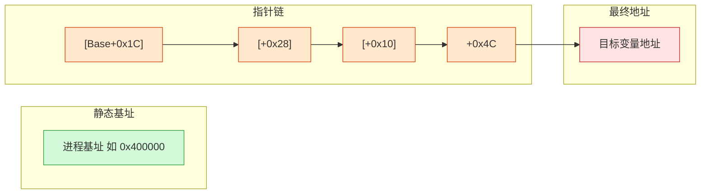
**指针扫描实操**：

1. 找到目标值的动态地址 → 右键 → `Pointer scan for this address`
2. 设置最大偏移层级（通常 5~7 级足够）
3. **必须重启应用**后重新附加、找到同一个值的新地址
4. 在新地址上右键 → `Re-Calculate address` → `Pointer scan`
5. CE 自动比对两次扫描结果，输出稳定的指针链

### 5.4 代码注入机制

CE 的 Auto Assembler 允许直接注入汇编代码到目标进程，修改执行流：

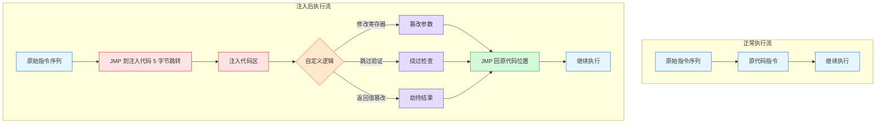
**典型注入场景**：

- 跳过 `jnz`、`je` 等条件跳转 → 绕过验证逻辑
- 修改函数返回值（eax） → 篡改校验结果
- NOP 掉关键校验指令 → 直接废除校验

### 5.5 内存保护常量与访问权限

CE 读取和写入目标进程内存时，受 Windows 内存保护常量的约束。理解这些常量有助于判断哪些内存区域可以修改：

| 常量名                   | 值   | 含义                 |   CE 可写？    |
| ------------------------ | ---- | -------------------- | :------------: |
| `PAGE_EXECUTE_READWRITE` | 0x40 | 可执行 + 可读 + 可写 |       ✅        |
| `PAGE_EXECUTE_READ`      | 0x20 | 可执行 + 可读        |       ❌        |
| `PAGE_READWRITE`         | 0x04 | 可读 + 可写          |       ✅        |
| `PAGE_READONLY`          | 0x02 | 仅可读               |       ❌        |
| `PAGE_WRITECOPY`         | 0x08 | 写入时复制           | ⚠️ 可写但不共享 |
| `PAGE_NOACCESS`          | 0x01 | 无访问权限           |       ❌        |

```c
// 通过 VirtualQueryEx 获取内存区域信息
MEMORY_BASIC_INFORMATION mbi;
VirtualQueryEx(hProcess, (LPCVOID)address, &mbi, sizeof(mbi));

// mbi.Protect 包含内存保护常量
if (mbi.Protect & PAGE_READWRITE) {
    // 这块内存可读可写——CE 的标准目标区域
} else if (mbi.Protect & PAGE_EXECUTE_READ) {
    // 代码段——CE 需要代码注入才能修改
}

// mbi.State 包含内存状态
if (mbi.State == MEM_COMMIT) {
    // 已提交（实际占用物理内存）——可正常读写
} else if (mbi.State == MEM_RESERVE) {
    // 已保留但未提交——读写会触发异常
}
```

**实战建议**：在 CE 的 Memory View 窗口中，不同颜色的区域代表不同的内存保护类型：

- **绿色**：可读写（R/W）— 数值修改的主要目标 ✅
- **蓝色**：可执行（E）— 代码注入的目标区域
- **灰色**：只读 — CE 无法直接修改，需通过代码注入绕过
- **红色**：已释放或未提交 — 无实际内容

---

## 第六章：Lua 脚本自动化

CE 内置了 Lua 5.x 脚本引擎，可将重复性扫描和修改操作自动化。挖洞时用 Lua 脚本可以大幅提升效率。

### 6.1 脚本基础框架

Lua 脚本在 CE 中的执行架构如下：

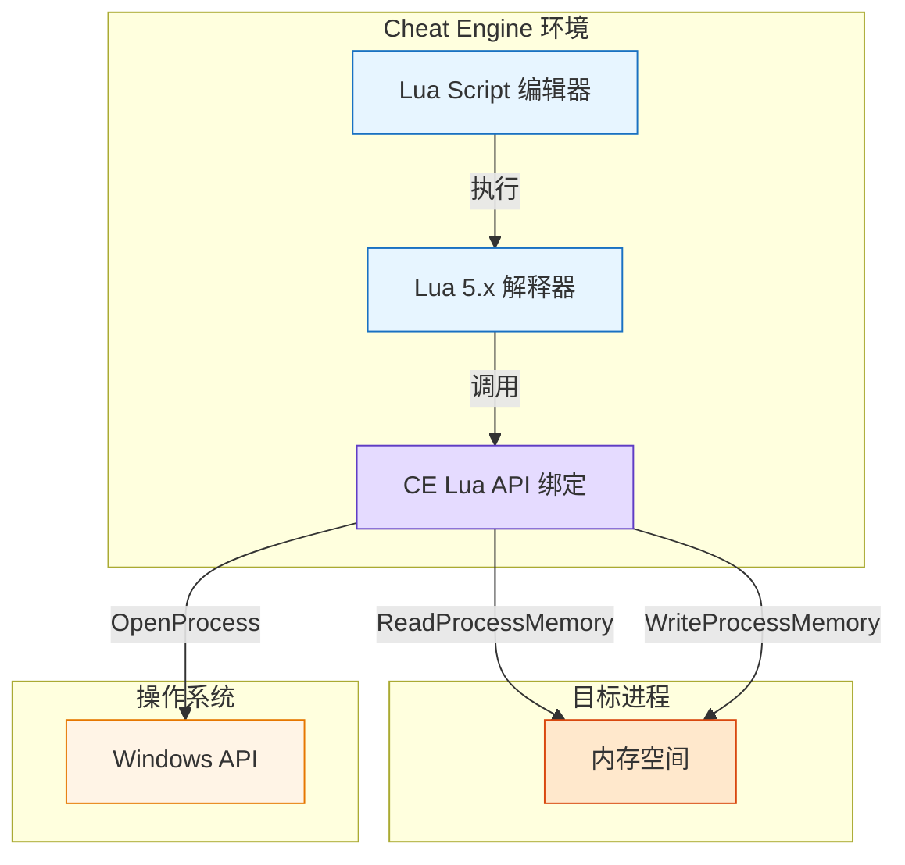
```lua
-- CE 中 Lua 脚本的基本结构
-- 通过 Cheat Engine 的 Script → Execute Lua Script 运行

-- 1. 附加进程
function attachProcess(processName)
    local procID = findProcess(processName)
    if procID == nil then
        print("未找到进程: " .. processName)
        return false
    end
    openProcess(procID)
    print("已附加: " .. processName)
    return true
end

-- 2. 扫描与修改
function scanAndModify(valueType, scanValue, newValue)
    clearMemoryScan()
    local scan = createMemoryScan()
    scan.onlyOneResult = false
    scan.firstScan(valueType, scanValue)
    local results = scan.getResults()
    print("找到 " .. #results .. " 个匹配地址")
    for i, addr in ipairs(results) do
        writeInteger(addr, newValue)
    end
end

-- 3. 持续监控（循环写入）
function freezeAddress(addr, value, interval_ms)
    while true do
        writeInteger(addr, value)
        sleep(interval_ms)
    end
end
```

### 6.2 自动化扫描脚本

```lua
-- 自动化模糊扫描：未知初始值 → 反复过滤 → 定位唯一地址
function autoParameterScan(processName)
    attachProcess(processName)
    clearMemoryScan()
    local scan = createMemoryScan()
    scan.firstScan(vtDword, 0, scanUnknown)
    print("首次扫描完成，地址数: " .. #scan.getResults())

    for i = 1, 8 do
        showMessage("请在应用中触发值变化，然后点击确定")
        pause()
        scan.nextScan(vtDword, 0, scanDecreased)
        local remaining = #scan.getResults()
        print("第 " .. i .. " 次过滤后剩余: " .. remaining .. " 个地址")
        if remaining <= 3 and remaining > 0 then
            print("已精确定位!")
            for j, addr in ipairs(scan.getResults()) do
                print(string.format("  地址 %d: 0x%X = %d",
                      j, addr, readInteger(addr)))
            end
            return scan.getResults()
        end
        if remaining == 0 then
            print("地址丢失，请重新扫描")
            return nil
        end
    end
    return scan.getResults()
end
```

### 6.3 实用脚本片段

```lua
-- 批量扫描隐藏布尔参数
scan: firstScan(vtString, nil, "is")   -- 搜索 isAdmin, isVIP 等
scan: firstScan(vtString, nil, "can")  -- 搜索 canModify 等
scan: firstScan(vtString, nil, "has")  -- 搜索 hasPermission 等

-- 锁定多个相关值（价格、数量、税费同时锁定）
local addresses = {0x12345678, 0x23456789, 0x34567890}
local values = {0, 9999, 0}
while true do
    for i, addr in ipairs(addresses) do
        writeInteger(addr, values[i])
    end
    sleep(50)
end

-- 自动记录值变化日志
local lastVal = readInteger(targetAddr)
while true do
    local currVal = readInteger(targetAddr)
    if currVal ~= lastVal then
        print(string.format("[%s] 地址 0x%X 从 %d 变更为 %d",
              os.date("%H:%M:%S"), targetAddr, lastVal, currVal))
        lastVal = currVal
    end
    sleep(100)
end
```

### 6.4 CE Lua API 速查

| API 函数                  | 功能                  | 参数说明                  |
| ------------------------- | --------------------- | ------------------------- |
| `openProcess(pid)`        | 根据 PID 打开进程     | pid: 进程 ID              |
| `findProcess(name)`       | 按名称查找进程 PID    | name: 进程名              |
| `readInteger(addr)`       | 读取 4 字节整数值     | addr: 内存地址            |
| `writeInteger(addr, val)` | 写入 4 字节整数值     | addr: 地址, val: 值       |
| `readFloat(addr)`         | 读取单精度浮点数      | addr: 内存地址            |
| `writeFloat(addr, val)`   | 写入单精度浮点数      | addr: 地址, val: 值       |
| `readString(addr, len)`   | 读取字符串            | addr: 地址, len: 最大长度 |
| `writeString(addr, str)`  | 写入字符串            | addr: 地址, str: 字符串值 |
| `freeze(addr, val, type)` | 锁定地址值            | 持续写入使值不变          |
| `createMemoryScan()`      | 创建内存扫描对象      | 返回扫描器对象            |
| `launchMonoDissect()`     | 枚举 Mono/.NET 程序集 | 针对 Unity 等应用         |
| `generatePointerMap()`    | 生成指针映射          | 用于指针扫描              |

### 6.5 脚本性能优化

CE 的 Lua 脚本在扫描大量地址时可能变慢，以下优化技巧可显著提升效率：

```lua
-- 优化1：批量读取而非逐字节读取
-- ❌ 慢速：逐字节比较
for i = 1, 10000 do
    local val = readInteger(baseAddr + i * 4)
    if val == target then
        print("找到:", baseAddr + i * 4)
    end
end

-- ✅ 快速：使用 readBytes 批量读取 + Lua 侧比较
local chunk = readBytes(baseAddr, 40000, true)  -- 一次读取 40000 字节
for i = 1, 10000, 4 do
    -- 手动从字节数组中解析 int32
    local val = chunk[i] | (chunk[i+1] << 8) | (chunk[i+2] << 16) | (chunk[i+3] << 24)
    if val == target then
        print("找到:", baseAddr + (i-1))
    end
end
-- 批量读取减少了 10000 次 ReadProcessMemory 调用，速度提升约 50~100 倍

-- 优化2：控制扫描频率避免被检测
function smartScanWithRateLimit(valueType, scanValue, maxAttempts)
    local rateLimitMs = 200  -- 每次扫描间隔 200ms
    for i = 1, maxAttempts do
        clearMemoryScan()
        local scan = createMemoryScan()
        scan.firstScan(valueType, scanValue)
        local count = #scan.getResults()
        print(string.format("第 %d 次: %d 个地址", i, count))
        if count <= 5 then
            return scan.getResults()
        end
        sleep(rateLimitMs)  -- 关键：控制频率
    end
    return nil
end

-- 优化3：使用局部变量缓存全局查找结果
-- ❌ 慢速：每次调用都重新查找
function badFind()
    for i = 1, 100 do
        local addr = findProcess("target.exe")  -- 重复查找
        -- ...
    end
end

-- ✅ 快速：只查找一次
local targetPid = findProcess("target.exe")
function goodFind()
    for i = 1, 100 do
        -- 直接使用缓存的 PID
        -- ...
    end
end
```

**性能对比参考**：

| 操作                    | 未优化 | 优化后   | 提升倍数 |
| ----------------------- | ------ | -------- | :------: |
| 扫描 10000 个 int32     | ~5 秒  | ~0.05 秒 |   100x   |
| 每 100ms 监控 10 个地址 | CPU 5% | CPU <1%  |    5x    |
| 批量修改 1000 个地址    | ~2 秒  | ~0.1 秒  |   20x    |

---

## 第七章：汇编级代码注入

对于数值扫描无法绕过的校验（如签名函数写死在编译代码中），需要在汇编层直接修改执行逻辑。

### 7.1 Auto Assembler 模板

```
[ENABLE]
// 启用注入 — 代码运行在这里
alloc(newmem,2048)            // 分配 2048 字节的新内存区
label(return)                 // 定义返回标签
label(originalCode)           // 定义原代码标签
registersymbol(return)        // 注册符号

newmem:                       // 注入代码区
  // 在这里写入自定义汇编逻辑
  // 示例：始终将 eax（函数返回值）设为 1
  mov eax,1

originalCode:                 // 原代码备份
  // 这里放被覆盖的原始指令
  // [原指令会被自动复制到这里]

return:
  jmp return                  // 跳回原执行流

// 在目标地址写入 JMP 跳转到注入代码
target_address:
  jmp newmem
  nop
  nop

[DISABLE]
// 禁用注入 — 恢复原始代码
// CE 自动恢复被修改的字节
dealloc(newmem)
unregistersymbol(return)
```

### 7.2 AOB 模式匹配

当目标地址动态变化时，可通过特征码（Array of Bytes）定位：

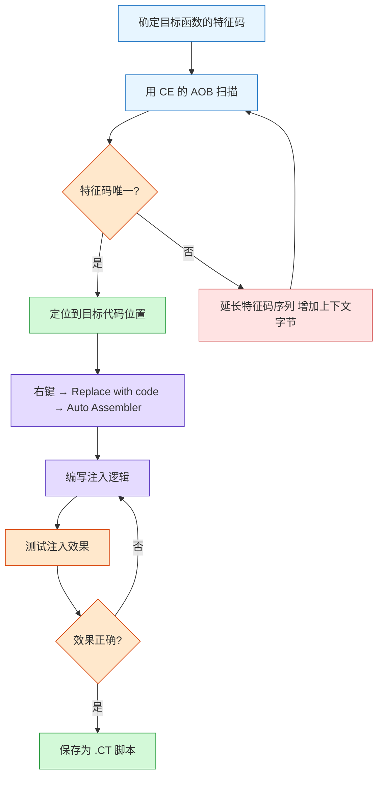
### 7.3 常见注入场景

| 目标               | 注入方式       | 汇编代码                      |
| ------------------ | -------------- | ----------------------------- |
| **函数始终返回真** | 修改函数开头   | `mov al,1` / `ret`            |
| **跳过条件跳转**   | NOP 掉跳转指令 | `nop; nop`（覆盖 `jnz xxx`）  |
| **跳过验证函数**   | 直接越过 CALL  | `jmp [验证函数结束地址]`      |
| **篡改比较参数**   | 修改入栈参数   | `push 0` 代替 `push [真实值]` |
| **修改循环计数器** | 注入循环体内   | `mov [ecx+offset], 0`         |

### 7.4 绕过签名校验的汇编示例

```
[ENABLE]
// 目标：跳过签名验证函数
// 定位到 call verifySignature 处
// 将 call 指令替换为 NOP

alloc(skipVerify, 128)
label(returnHere)

skipVerify:
  // 模拟验证通过：
  // 原函数返回 0=失败, 1=成功
  mov eax, 1          // 始终返回"验证通过"
  jmp returnHere

// 替换目标位置的 call 指令
target_signature_call:
  jmp skipVerify
  nop
  nop
  nop
  nop
  nop

returnHere:
  // 正常执行流继续

[DISABLE]
// CE 自动恢复
```

### 7.5 注入方式对比：Detour 注入 vs VEH 注入

CE 支持多种代码注入方式，各自有优劣势：

| 对比维度            | Detour 注入（传统 JMP）                | VEH 注入（异常处理）                          |
| ------------------- | -------------------------------------- | --------------------------------------------- |
| **原理**            | 修改目标地址指令为 JMP，跳转到注入代码 | 设置内存页为无访问权限，触发异常后由 VEH 处理 |
| **检测难度**        | 低——代码修改易被完整性校验检测         | 高——不修改代码，仅改页权限                    |
| **稳定性**          | 高——确定性的执行流                     | 中——异常处理有额外延迟                        |
| **兼容性**          | 需处理指令对齐问题                     | 无需处理对齐                                  |
| **适用场景**        | 长期 hook、需要稳定修改                | 反检测对抗、临时绕过                          |
| **CE 中的实现方式** | Auto Assembler 模板                    | Debugger Options → VEH Debugger               |

**选择建议**：

- 目标无完整性校验 → 优先使用 Detour 注入，稳定可靠
- 目标有反 CE 检测 → 启用 VEH Debugger，避免被检测
- 需要同时 hook 多个函数 → Detour 更易管理
- 只需临时跳过某个校验 → VEH 更快捷

---

## 第八章：反检测对抗技术

目标应用可能有反 CE 检测机制。理解这些检测手段和绕过方法，是实战中能否成功的关键。反检测对抗的核心在于：**检测发生在应用层与内核层，而绕过发生在更深层（Hypervisor 层）或更隐蔽的执行路径（VEH 异常处理）。**

### 8.1 检测与绕过矩阵

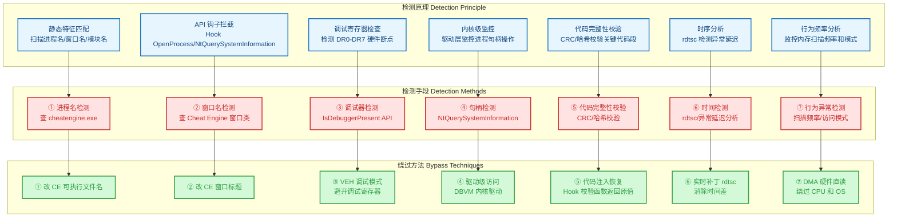
| 检测类型           | 绕过方案      | 操作方式                                     |
| ------------------ | ------------- | -------------------------------------------- |
| **进程名黑名单**   | 重命名 CE     | 复制 `cheatengine.exe` 为 `svchost.exe` 运行 |
| **窗口类名检测**   | 修改窗口属性  | CE → Edit → Settings → 勾选隐藏选项          |
| **调试寄存器检测** | 使用 VEH 调试 | CE 设置中启用 VEH Debugger                   |
| **内核态钩子**     | DBVM 虚拟机   | 安装 CE 内核驱动，Hypervisor 层运作          |
| **扫描频率检测**   | 降低扫描间隔  | Lua 脚本控制扫描节奏                         |
| **代码段校验**     | 恢复原始代码  | Auto Assembler 禁用时自动恢复                |

### 8.2 VEH 调试模式

**VEH（Vectored Exception Handling）** 是 CE 绕过反调试的核心技术：

```
传统调试器:     INT3 断点 → 被调试器捕获 → 可被检测
CE VEH 模式:   非法指令 → 触发异常 → VEH 处理 → 不被检测为调试器

启用方式: CE → Settings → Debugger Options → Use VEH Debugger
优势: 不修改代码、不占用调试寄存器(DR0-DR7)、不被 IsDebuggerPresent 检测
```

VEH 异常处理机制的执行流程：

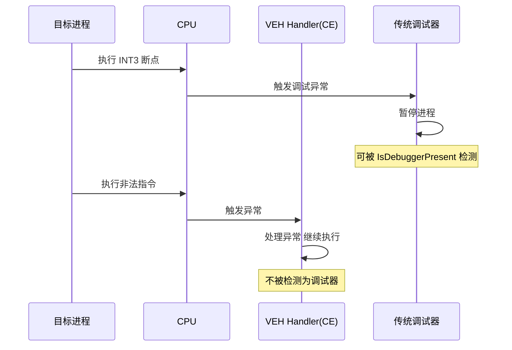
### 8.3 DBVM 内核级访问

```
DBVM (Driver-Based Virtual Machine) 是 CE 的内核级组件：
- 工作在 Ring -1（Hypervisor 层），在操作系统之下
- 通过 Intel VT-x / AMD-V 硬件虚拟化实现
- 内存访问延迟降至 7~12 微秒
- 绕过所有用户态和内核态的检测钩子
- 目标操作系统完全不知道自己被监控

风险: 需要加载内核驱动，触发 Windows PatchGuard
      建议在测试虚拟机或已关闭驱动签名的环境中使用
```

### 8.4 定时器与频率检测绕过

部分反作弊系统通过监控 CE 的扫描频率来检测调试行为。破解这种检测需要控制扫描的时间间隔和模式：

```
检测原理:
  反作弊系统记录 ReadProcessMemory 调用的时间戳
  → 如果检测到密集模式（每 10~50ms 一次）→ 判定为 CE
  → 正常应用的内存访问间隔通常 > 200ms

绕过策略 A：随机化间隔
  在 Lua 脚本中引入随机延迟，模拟正常应用的访问模式

绕过策略 B：伪装为正常 API 调用
  使用 CE 的 DBVM 模式 → 绕过 Ring 3 的 API 监控
  或用 VEH 模式 → 异常触发而非常规内存读取

绕过策略 C：降低采样率
  不是每 50ms 读一次，而是每 500ms 读一次
  虽然响应变慢，但降低了被检测的概率
```

```lua
-- 反频率检测的 Lua 扫描脚本
function undetectedScan(valueType, scanValue)
    clearMemoryScan()
    local scan = createMemoryScan()
    scan.firstScan(valueType, scanValue)

    for i = 1, 10 do
        -- 随机化延迟，范围 300~800ms
        local delay = 300 + math.random(500)
        sleep(delay)

        showMessage("请在应用中触发值变化")
        pause()
        scan.nextScan(valueType, scanValue, scanDecreased)

        local remaining = #scan.getResults()
        print(string.format("[%s] 第 %d 次: %d 地址 (延迟 %dms)",
              os.date("%H:%M:%S"), i, remaining, delay))

        if remaining <= 3 then
            return scan.getResults()
        end
    end
end
```

---

## 第九章：工具链联动

CE 单打独斗能力有限，与 IDA Pro、Burp Suite、Frida 等联动才能发挥最大挖洞威力。下图展示了各工具的能力覆盖范围：

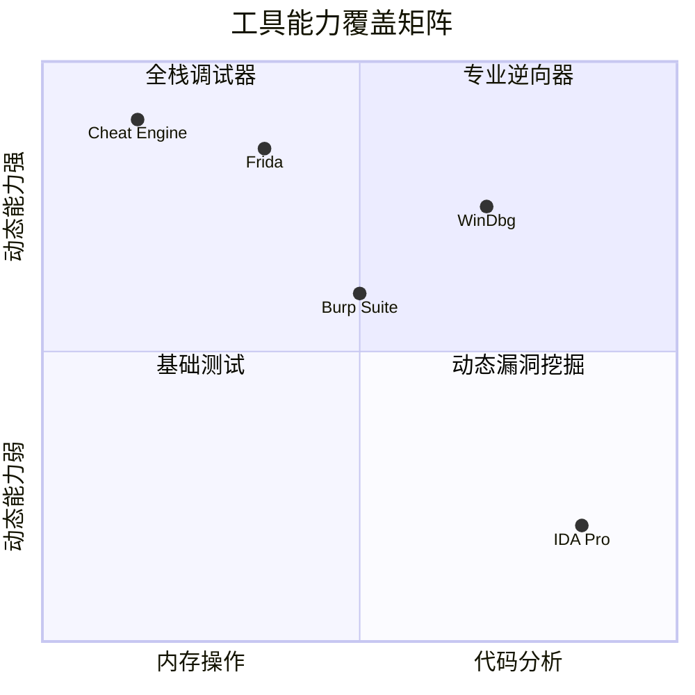
### 9.1 CE + IDA Pro 联动分析

```mermaid
flowchart LR
    subgraph ce["CE"]
        CE1[内存扫描 定位关键数值]:::red
        CE2[内存断点 定位写操作]:::red
        CE3[查看调用堆栈]:::red
    end
    subgraph link["联动"]
        L1[复制地址或反汇编]:::orange
    end
    subgraph ida["IDA Pro"]
        IDA1[跳转到对应地址]:::blue
        IDA2[静态分析代码逻辑]:::blue
        IDA3[标注关键函数和数据结构]:::blue
    end
    CE1 --> L1 --> IDA1
    CE2 --> L1
    CE3 --> L1
    IDA1 --> IDA2 --> IDA3
    IDA3 -.->|回到 CE 验证| CE1

    classDef red fill:#ffe3e3,stroke:#c92a2a
    classDef blue fill:#e7f5ff,stroke:#1971c2
    classDef orange fill:#ffe8cc,stroke:#d9480f
```
**联动流程**：

1. CE 中找到关键数值 → 下内存断点 → 触发时暂停
2. 查看调用堆栈，确定是哪段代码在操作该值
3. 将地址复制到 IDA Pro，反汇编分析完整逻辑
4. 在 IDA 中理解算法 → 回到 CE 做动态验证

### 9.2 CE + Burp Suite 联动

```mermaid
sequenceDiagram
    participant CE as Cheat Engine
    participant APP as 客户端应用
    participant BP as Burp Suite
    participant API as 后端 API
    CE->>CE: 扫描并定位参数
    CE->>APP: 修改内存值
    APP->>BP: 发送篡改后的请求
    BP->>BP: 拦截并查看请求
    BP->>BP: 进一步修改参数
    BP->>API: 发送修改后的请求
    API-->>BP: 返回响应
    BP-->>APP: 转发响应
    alt 服务端校验不足
        APP-->>CE: 漏洞效果可见
        CE->>CE: 确认漏洞存在
    else 服务端有校验
        API-->>BP: 拒绝或错误
        BP->>CE: 需要回 CE 重试
    end
```
### 9.3 CE + Frida 联动（APP 端）

```
APP 端测试工作流：

1. CE  → 附加到 Android/iOS 模拟器进程
         （或用 CE 附加到 Frida Server 所在进程）

2. Frida → Hook 关键函数，拦截 Java/ObjC 方法调用

3. 联动技巧：
   - CE 修改内存值后，Frida 观察函数输入输出
   - 反之，Frida Hook 后强制修改参数，CE 监控内存变化
   - CE 定位内存地址 → Frida 编写持久化 hook
```

### 9.4 CE MCP Bridge — AI 辅助逆向

**最新趋势：CE + AI 联动挖洞**

[Cheat Engine MCP Bridge](https://github.com/miscusi-peek/cheatengine-mcp-bridge) 将 CE 的 180+ 个接口暴露为 MCP 工具，让 AI 直接操作 CE：

```
支持的 AI 操作包括：
- 自动指针扫描 → AI 分析指针链
- 内存区域分析 → AI 识别数据结构
- 自动断点管理 → AI 定位关键代码
- 内存搜索与修改 → AI 驱动的漏洞发现
- Lua 脚本生成 → AI 写自动化脚本
```

### 9.5 CE + WinDbg 内核调试联动

对于驱动级别的反调试或需要内核态分析的场景，WinDbg 是不可或缺的补充工具：

```
联动工作流：

Step 1: CE 定位用户态的内存地址和数值
Step 2: WinDbg 附加到同一目标进程（内核调试模式）
Step 3: 在 WinDbg 中下硬件断点：
          ba w4 0x12345678  （当该地址被写入 4 字节时中断）
Step 4: 触发 CE 修改值 → WinDbg 捕获到写操作
Step 5: 在 WinDbg 中查看调用堆栈：
          k            （显示当前调用栈）
          !process 0 0 （查看进程信息）
Step 6: 分析走内核路径还是用户态路径

适用场景：
- 反 CE 驱动拦截了 ReadProcessMemory / WriteProcessMemory
- 目标使用内核回调监控进程句柄
- 需要分析内存写入的来源代码路径
```

**CE + WinDbg 的典型问题定位案例**：

```
现象: CE 修改值后立即恢复原值
原因: 目标程序有独立的看门狗线程周期性校验内存
定位: WinDbg 下 ba w4 addr → 触发中断 → k 查看堆栈
       → 发现 watchdog 线程在调用 checksum 函数
解  决: 在 CE 中同时冻结校验值，或 Auto Assembler 跳过校验
```

### 9.6 多工具协同矩阵总览

| 场景         | 主工具     | 辅助工具   | 协同方式                               |
| ------------ | ---------- | ---------- | -------------------------------------- |
| 隐藏参数发现 | CE         | Burp Suite | CE 定位 → 修改 → Burp 验证数据包       |
| 签名绕过     | CE + Frida | IDA        | Frida Hook 签名函数 → CE 锁定参数      |
| 反调试绕过   | CE (VEH)   | WinDbg     | VEH 避开用户态检测 → WinDbg 分析驱动层 |
| 代码逻辑分析 | IDA Pro    | CE         | IDA 静态分析 → CE 动态验证             |
| 手游修改     | CE         | Frida      | CE 附加模拟器 → Frida Hook 游戏方法    |

---

## 第十章：实战案例库

前面九章拆解了 CE 内存扫描、汇编注入、Mono 分析、进程定位等各项技术，本章将这些技术落地为完整的实战案例。

### 10.1 Unity Mono 参数泄露

**场景**：基于 Unity 引擎的应用，使用 Mono 运行时

```mermaid
flowchart TB
    A[CE 附加进程]:::blue --> B[Mono Dissector 枚举所有类和方法]:::purple
    B --> C[查看字段值 发现 isVIP = false]:::orange
    C --> D[修改 isVIP = true]:::red
    D --> E{触发 VIP 功能}:::orange
    E -->|可用| F[确认逻辑漏洞 服务端未校验]:::green
    E -->|不可用| G[服务端有校验 需要更深入]:::yellow

    classDef green fill:#d3f9d8,stroke:#2f9e44
    classDef red fill:#ffe3e3,stroke:#c92a2a
    classDef blue fill:#e7f5ff,stroke:#1971c2
    classDef orange fill:#ffe8cc,stroke:#d9480f
    classDef purple fill:#e5dbff,stroke:#5f3dc4
    classDef yellow fill:#fff4e6,stroke:#e67700
```
**Unity 特有挖掘要点**：

- 使用 `Mono` 菜单 → `Dissect Mono` → 自动枚举所有 C# 类、字段、方法
- 直接搜索字段名（如 `isAdmin`、`playerLevel` 等）
- 如果是 IL2CPP 打包，需用 AOB 扫描特征码

### 10.2 WebAssembly 应用内存分析

**场景**：浏览器中运行的 WebAssembly 应用（网页游戏、在线工具）

```
CE 接入方式：
1. CE 附加到浏览器渲染进程（chrome.exe）
2. 浏览器中打开目标 WebAssembly 应用
3. 在浏览器进程中搜索数值
   - 搜索金币或分数等 — 通常以 Float 或 Int32 存储
   - 搜索字符串 — 游戏内的配置或参数名
4. 注意：WASM 内存通常是连续的线性内存区域
   - 在 CE 中会显示为一大块 MEM_PRIVATE 区域
```

### 10.3 C/S 架构数据包参数定位

**场景**：传统 C/S（客户端-服务器）架构的桌面应用

```
挖掘流程：
1. 用 Wireshark 或 Burp 抓包 → 观察请求参数
2. 在 CE 中搜索参数内存 → 找到参数名或参数值
3. 修改参数 → 观察数据包变化
4. 分析哪些参数只在校验后使用（后端信任的标志位）

典型发现：
- 权限标志位（isAdmin/userType/role）只在校验后读取一次
- 前端缓存的价格或倍率值被当作计算依据
- 支付流程中的中间结果被缓存
```

### 10.4 CE + Burp 双工具联动——支付漏洞挖掘

```mermaid
sequenceDiagram
    actor H as 攻击者
    participant APP as 应用
    participant CE as Cheat Engine
    participant BP as Burp Suite
    participant API as 后端
    H->>APP: 创建订单：单价 100，数量 1
    APP->>APP: 在内存中计算总价
    H->>CE: 扫描总价（100）
    CE-->>H: 找到内存地址
    H->>CE: 修改总价为 1
    CE->>APP: 内存值变为 1
    APP->>BP: 提交订单
    BP->>BP: 拦截请求
    H->>BP: 观察请求中的总价参数
    alt 总价为 1（CE 修改生效）
        BP->>API: 放行（总价=1）
        API-->>BP: 支付金额 1 元
        BP-->>H: 漏洞确认：服务端信任了内存值
    else 总价为 100（服务端自己算）
        BP->>BP: 说明服务端未信任内存值
        H->>APP: 重新尝试其他参数
    end
```
### 10.5 模拟器手游反作弊绕过

**场景**：在 PC 安卓模拟器中运行手游，手游集成了反作弊 SDK

**挑战**：手游的反作弊 SDK 会在内存中加密关键数值、检测调试器、扫描 CE 进程

```
绕过流程：

Layer 1 — 环境准备:
  1. 使用 Magisk + Zygisk 隐藏 Root
  2. 安装 LSPosed 模块：Hide My Applist、BootloaderSpoofer
  3. 将 CE 改名为 svchost.exe，窗口名改为 "Windows Manager"

Layer 2 — 附加策略:
  1. 雷电模拟器 → 附加到 ldboxheadless.exe
  2. 蓝叠模拟器 → 附加到 HD-Player.exe
  3. 夜神模拟器 → 附加到 NoxVMHandle.exe

Layer 3 — 内存搜索:
  1. 开启 CE 的 VEH Debugger（避免调试器检测）
  2. 使用模糊扫描（Unknown initial value）而非精确扫描
  3. 找到数值后，用指针扫描获取稳定地址链
  4. 保存为 .CT 文件，下次直接加载

Layer 4 — 修改与锁定:
  1. 使用 Auto Assembler 注入而非直接写内存
  2. 锁定修改的地址周期性重写（防止看门狗恢复）
  3. 同时修改相关联的校验值和显示值
```

**避坑要点**：

- 某些手游在支付时会切换到服务端计算，此时 CE 修改无效——需结合 Burp 抓包确认
- 模拟器的多开功能会启动新进程，需要重新附加
- 反作弊 SDK（如 XignCode、GameGuard）有驱动级保护，可能需要在 VM 中绕过

---

## 第十一章：常见陷阱与调试指南

CE 挖洞过程中，新手和经验丰富的测试者都会遇到一些典型的陷阱。本节系统整理最常见的卡点及其解决方案。

### 11.1 搜不到值的八大原因

|  #   | 原因           | 排查方法                                      | 解决方案                      |
| :--: | -------------- | --------------------------------------------- | ----------------------------- |
|  1   | 附加错了进程   | Chrome 任务管理器确认标签页 PID               | 用 Shift+Esc 直查             |
|  2   | 值类型选错     | 尝试 4 Bytes、Float、Double、8 Bytes 逐一测试 | 不确定时逐个类型扫描          |
|  3   | 值被加密       | 搜索值和使用值不是同一格式                    | 用模糊扫描 + 改变操作交叉验证 |
|  4   | 权限不足       | CE 未以管理员运行                             | 右键 → 以管理员身份运行       |
|  5   | 内存类型未勾选 | 默认只扫描 MEM_IMAGE                          | 勾选 All Memory Types         |
|  6   | 值在子进程中   | 目标用了多进程架构                            | 逐一附加所有子进程测试        |
|  7   | 扫描时机不对   | 在值未初始化时扫描                            | 确保目标值已加载后再开始      |
|  8   | 虚拟地址临时性 | 值只在特定操作中存在                          | 在操作执行的同时保持扫描      |

### 11.2 修改无效的排查路径

```
修改后无反应 → 检查：
  ├── 修改的值是否被立即恢复？
  │     → 是：有看门狗线程 → 用 Auto Assembler 锁定
  │     → 否：继续
  ├── 服务端是否信任该值？
  │     → 是：检查 Burp 中数据包的值是否同步
  │         → 不同步：服务端用自己的计算值
  │         → 同步但服务端拒绝：服务端有额外校验
  │     → 否：换参数测试
  ├── 是否是显示值而非逻辑值？
  │     → 是：搜索与显示值关联的其他地址
  │     → 否：继续
  └── 是否触发了反作弊？
        → 是：启用 VEH Debugger + 降低频率
        → 否：换扫描策略
```

### 11.3 CE 崩溃或目标崩溃的常见原因

| 现象               | 原因                       | 对策                         |
| ------------------ | -------------------------- | ---------------------------- |
| 修改后目标立即崩溃 | 写入了代码段或关键数据结构 | 确认地址类型是正确的数值区域 |
| CE 附加后未响应    | 目标进程有反调试驱动       | 使用 VEH 模式或 DBVM 模式    |
| 扫描结果总为 0     | 进程句柄权限不足           | 以管理员身份运行 CE          |
| 锁定值后值仍在变   | 有更高优先级的写操作       | 用内存断点定位写操作来源     |
| CT 脚本下次失效    | 地址动态变化（ASLR）       | 用指针扫描而非固定地址       |

---

## 附录 A：最佳实践速查表

| #    | 要点            | 说明                                                |
| ---- | --------------- | --------------------------------------------------- |
| 1    | **CE 版本**     | 推荐 CE 7.5+，支持更多扫描类型                      |
| 2    | **反作弊对抗**  | 改 exe 名、改窗口名、启用 VEH 调试                  |
| 3    | **虚拟内存**    | 勾选 All Memory Types，扫描 MEM_PRIVATE 区域        |
| 4    | **配合 Burp**   | CE 改内存 + Burp 抓包 = 全链路验证                  |
| 5    | **多值联动**    | 修改一个值后注意检查相关值是否同步                  |
| 6    | **持久化**      | CE 修改默认只影响内存，重启后恢复                   |
| 7    | **搜索技巧**    | 不确定值时用 Unknown initial value + 增/减/不变过滤 |
| 8    | **指针扫描**    | 动态地址用 Pointer scan 找到基址偏移链              |
| 9    | **Lua 自动化**  | 编写自动扫描或修改脚本提升效率                      |
| 10   | **AOB 特征码**  | 代码注入用 Array of Bytes + 通配符定位              |
| 11   | **VEH 调试**    | 启用 VEH Debugger 避免传统调试器检测                |
| 12   | **DBVM 驱动**   | 需要 Ring0 级别操作时加载内核驱动                   |
| 13   | **进程筛选**    | 附加时关注内存突增的进程                            |
| 14   | **手游模拟器**  | 雷电或蓝叠附加到模拟器主进程                        |
| 15   | **CT 脚本复用** | 找到稳定地址后保存为 .CT 文件                       |

## 附录 B：漏洞成功率评估矩阵

```
漏洞发现概率与以下因素相关：

服务端信任度越高           → 成功率越高
客户端缓存越多            → 成功率越高
后端校验越少              → 成功率越高
数据实时交互越少          → 成功率越高

最佳目标特征：
  √ 数据在客户端有缓存或副本
  √ 修改后能明显影响应用行为
  √ 服务端响应不做二次校验
  √ 使用本地计算值（如前端算总价）
  √ 有布尔或权限标志位（isVIP、isAdmin 等）
```

## 附录 C：CE 能做什么 vs 不能做什么

| 能做的                         | 不能做的                     |
| ------------------------------ | ---------------------------- |
| 修改客户端本地存储的临时值     | 修改服务端数据库中的数据     |
| 绕过前端（JS/客户端）校验      | 绕过严格的服务端参数校验     |
| 发现服务端信任客户端的逻辑漏洞 | 发现 SQL 注入等传统 Web 漏洞 |
| 定位内存中的隐藏状态或参数     | 破解高强度加密（如 AES-256） |
| 通过汇编注入绕过本地验证函数   | 绕过有人机验证（CAPTCHA）    |
| 辅助逆向分析程序逻辑           | 自动挖掘 0day 漏洞           |

## 附录 D：法律声明

> ⚠️ **重要提示：本文所有技术内容仅可用于合法授权的安全测试、CTF 竞赛、个人学习研究。**

| 场景                             | 合法性     |
| -------------------------------- | ---------- |
| 在授权的 SRC（安全响应中心）测试 | ✅ 合法     |
| 参加 CTF 竞赛或漏洞挖掘比赛      | ✅ 合法     |
| 对自己拥有的软件做安全测试       | ✅ 合法     |
| 渗透测试项目（有书面授权）       | ✅ 合法     |
| 修改他人的商业软件或游戏         | ❌ 非法     |
| 用于制作外挂或作弊器获利         | ❌ 非法     |
| 窃取他人账号或虚拟财产           | ❌ 构成犯罪 |

## 附录 E：方法论全景图

```mermaid
mindmap
  根((CE 辅助漏洞<br/>挖掘方法论))
    内存扫描
      精确扫描
      模糊扫描
      字符串扫描
      AOB 特征码
    篡改技术
      整数溢出
      浮点绕过
      值锁定
      返回包篡改
    代码注入
      Auto Assembler
      AOB 定位
      VEH 调试
      签名绕过
    进程定位
      Chrome 多进程
      PID 转换
      Process Explorer
      CE 附加技巧
    自动化
      Lua 脚本
      批量扫描
      值监控
    工具联动
      IDA Pro 静态分析
      Burp Suite 抓包
      Frida 动态 Hook
      AI + MCP
```
---

> **全文完**
>
> *本文所有技术内容仅供学习研究，请勿用于非法用途。*